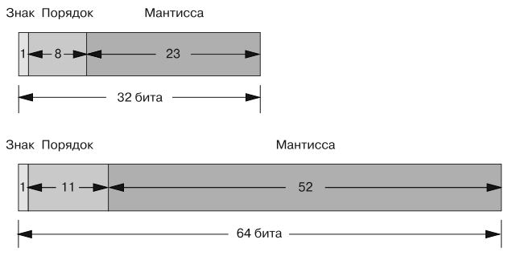
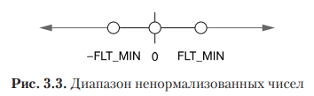

<a id="top"></a> 

### [⬅️ README][readme]
## [Глава 3. Арифметические типы](#top)
Проекты выполнены в операционной системе Ubuntu (поверх WSL 2).


По книге **Роберт С. Сикорд - Эффективный С. Профессиональное программирование**.


---
<a id="content"></a> 

### [Содержание](#top)
- ### [Целые числа](#section_01)
- ### [Числа с плавающей запятой](#section_02)
- ### [Арифметическое преобразование](#section_03) 


---
<a id="section_01"></a> 

## [Целые числа](#top)
***Значение*** целочисленного объекта является обычным математическим числом и ***представлено*** в виде битов в выделенной для объекта памяти, которые кодируют это значение.


Все целочисленные типы, кроме char, signed char и unsigned char, могут содержать неиспользуемые биты, которые называются ***заполнением***.


***Заполенения*** позволяют: 
- реализации обходить причуды аппаратной платформы (*такие как пропуск бита со знаком посреди представления из нескольких машинных слов*);
- оптимально поддерживать целевую архитектуру. 


***Ширина числа*** - это количество битов, используемых для представления значения заданного типа, не считая заполнения, но включая знак (зачастую обозначается как `N`).


***Точность*** — это количество битов, используемых для представления значения, не считая знака и заполнения.


***Заголовочный файл `<limits.h>` предоставляет минимальные и максимальные допустимые значения*** для различных целочисленных типов. 


***Допустимое значение*** - это такое, которое можно представить с помощью того количества битов, которое доступно объекту конкретного типа. 


❗***Компилятор, встречая значение, которое нельзя представить, может либо выдать диагностическое сообщение, либо преобразовать значение в представимое (хоть и некорректное).***


***Стандарт C предъявляет к размерам целых чисел 3 требования:*** 
1. область хранения любого типа данных должна иметь объем, кратный размеру объекта `unsigned char` (возможно, включая заполнение); 
2. каждый целочисленный тип должен поддерживать минимальный переносимый диапазон значений, на который можно положиться в любой реализации. 
3. меньший тип неможет быть шире большего. Поэтому `USHRT_MAX`, к примеру, не может быть больше `UINT_MAX`, хотя типы `unsinged short` и `unsinged int` могут иметь одинаковую ширину.


### Беззнаковые числа. Циклический перенос
***Циклический перенос (wraparound)*** происходит при выполнении арифметической операции, результат которой слишком маленький (меньше `0`) или большой (больше `2N – 1`), чтобы его можно было представить в виде конкретного беззнакового целочисленного типа. В этом случае берется остаток от деления значения на `N`, которое на единицу больше максимально допустимого значения итогового типа. 


❗***В языке C циклический перенос является определенным поведением.*** 


Код ниже присваивает переменной `ui` максимально допустимое значение и затем инкрементирует ее. Полученный результат нельзя представить как `unsigned int`, поэтому он циклически переносится и превращается в `0`. Если это значение декрементировать, то оно снова выйдет за рамки допустимого диапазона и в результате циклического переноса превратится в `UINT_MAX`.


```c
unsigned int ui = UINT_MAX; // 4,294,967,295 в x86

ui++;
printf("ui = %u\n", ui); // ui равно 0

ui--;
printf("ui = %u\n", ui); // ui равно 4,294,967,295
```


Ввиду циклического переноса ***беззнаковое целочисленное выражение никогда не может быть меньше `0`***. 


Например, переменная `i` в следующем цикле `for` не может иметь отрицательного значения, поэтому данный цикл никогда не прервется:


```c
for (unsigned int i = n; i >= 0; --i)
```


Чтобы избежать незапланированного поведения, необходимо удостовериться в отсутствии циклического переноса с учетом лимитов, указанных в заголовочном файле `<limits.h>`. 


Нужно быть осторожным при реализации этих проверок, поскольку в них легко ошибиться. Например, следующий код содержит дефект, так как `sum + ui` никогда не может быть больше, чем `UINT_MAX`:


```c
extern unsigned int ui, sum;

// присваиваем значения переменным ui и sum
if (sum + ui > UINT_MAX) {
    too_big();
}
else {
    sum = sum + ui;
}
```


Если результат `sum + ui` больше `UINT_MAX`, то приводится по модулю к `UINT_MAX + 1`. Таким образом вся эта проверка оказывается бесполезной и сгенерированный код всегда будет выполнять сложение. 


Чтобы исправить положение, можно вычесть `sum`из обеих сторон неравенства с целью создать следующую эффективную проверку:


```c
extern unsigned int ui, sum;

// присваиваем значения переменным ui и sum
if (ui > UINT_MAX - sum){
    too_big();
}
else {
    sum = sum + ui;
}
```


Значение `UINT_MAX` — самое большое, какое может быть представлено как `unsigned int`, а `sum` находится где-то между `0` и `UINT_MAX`: 
- если `sum` равно `UINT_MAX`, то разность будет равна `0`; 
- если `sum` равно `0`, то результат будет равен `UINT_MAX`. 


Поскольку значение, возвращаемое этой операцией, всегда находится в допустимом диапазоне (от `0` до `UINT_MAX`), с ним не может произойти ***циклический перенос***.


Та же проблема возникает при сравнении результата арифметической операции (`j`) с `0` (минимальным беззнаковым значением):


```c
extern unsigned int i, j;
// присваиваем значения переменным i и j
if (i - j < 0) {// это невозможно
    negative();
}
else {
    i = i - j;
}
```


Поскольку беззнаковые целочисленные значения никогда не могут быть отрицательными, вычитание будет выполняться в любом случае. Вместо этого можно сравнить `j` с `i`, чтобы узнать происходит ли циклический перенос:


```c
if (j > i) {// правильно
    negative();
}
else {
    i = i - j;
}
```


Если `j > i`, то мы можем с уверенностью сказать, что результат будет циклически перенесен. Убрав из проверки операцию вычитания, исключается возможность возникновения циклического переноса во время ее выполнения.


❗***ВНИМАНИЕ: ширина***, используемая при переносе, зависит от реализации. Это значит, что на разных платформах можно получить различные результаты. Если этого не учитывать, то код не будет переносимым!


### Знаковые целые
***Целочисленные типы со знаком*** имеют более сложное представление, чем их беззнаковые аналоги. Язык C традиционно поддерживает 3 варианта представления таких значений:
1. ***прямой код*** — старший разряд обозначает знак, а остальные разряды представляют величину значения в обычной двоичной системе;
2. ***обратный код*** — разряду со знаком назначается ***вес*** ${–(2^{N – 1} – 1)}$, а остальные разряды значения имеют те же веса, что и в беззнаковом типе;
3. ***дополнительный код*** — разряду со знаком назначается ***вес*** ${–(2^{N – 1})}$, а остальные разряды значения имеют теже веса, что ив беззнаковом типе.


❗***Нельзя выбрать конкретное представление:*** оно определяется теми, кто реализует ***язык C*** для различных систем. В употреблении находятся все три варианта, но последний намного популярнее — настолько, что *комитет во главе стандарта C собирается оставить в спецификации C2x лишь дополнительный код.* 


#### Представление знакового числа через дополнительный код
***Целочисленные типы со знаком и шириной `N`*** способны представить любое целое значение в диапазоне от ${–2^{N – 1}}$ до ${2^{N – 1} – 1}$. Это означает, что восьмибитное значение типа `signed char` имеет диапазон 
от ${–128}$ до ${127}$. 


***Дополнительный код*** может также представить еще одно самое маленькое отрицательное значение. Для восьмибитного типа `signed char` это ${–128}$, и его модуль, ${|–128|}$, не может быть представлен данным типом. Подобное положение приводит к возникновению ряда интересных граничных ситуаций, которые будут рассмотрены ддальше.


В следующей таблице перечислены константные выражения из заголовочного файла `<limits.h>` для каждого типа со знаком, минимальный диапазон, который требуется согласно стандарту, и фактический диапазон в современных реализациях ***x86***.


***Диапазоны целых чисел со знаком***
| Константное выражение | Минимальные величины                          | Значение в x86    | Тип           |
|-----------------------|-----------------------------------------------|-------------------|---------------|
| `SCHAR_MIN`           | –127 //${–(2^{7–1})}$                         | ${-2^{7–1}-1}$    | `signed char` |
| `SCHAR_MAX`           | +127 //${2^{7–1}}$                            | ${2^{7–1}}$       | `signed char` |
| `SHRT_MIN`            | –32 767 //${–(2^{15–1})}$                     | ${-2^{15–1}-1}$   | `short`       |
| `SHRT_MAX`            | +32 767 //${2^{15–1}}$                        | ${2^{15–1}}$      | `short`       |
| `INT_MIN`             | –32 767 //${–(2^{15–1})}$                     | ${–(2^{15–1})-1}$ | `int`         |
| `INT_MAX`             | +32 767 //${2^{15–1}}$                        | ${2^{15–1}} $     | `int`         |
| `LONG_MIN`            | –2 147 483 647 //${–(2^{31–1})}$              | ${–(2^{31–1})-1}$ | `long`        |
| `LONG_MAX`            | +2 147 483 647 //${2^{31–1}}$                 | ${2^{31–1}-1}$    | `long`        |
| `LLONG_MIN`           | –9 223 372 036 854 775 807 //${–(2^{63–1})}$  | ${–(2^{63–1})-1}$ | `long long`   |
| `LLONG_MAX`           | +9 223 372 036 854 775 807 //${2^{63–1}}$     | ${2^{63–1}-1}$    | `long long`   |


***Представление отрицательных чисел в дополнительном коде*** состоит из разрядов для хранения знака и самого значения. Разряду со знаком назначается вес ${–(2^{N – 1})}$. Чтобы сделать значение отрицательным в дополнительном коде, достаточно инвертировать каждый значащий бит и затем прибавить 1 (с переносом, если это необходимо).


В следующей таблице показаны двоичные и десятичные представления для 8-битного целочисленного типа со знаком в дополнительном коде без заполнения (то есть ${N=8}$). 

***Значения в прямом и дополнительном кодах ${(N=8)}$***
| Двоичное (прямой код) | Двоичное (доп. код)   | Десятичное (unsigned) | Десятичное (signed)   | Вес (доп. код)                | Константа     |
|-----------------------|-----------------------|-----------------------|-----------------------|-------------------------------|---------------|
| 00000000              | 00000000              | 0                     | 0                     | ${0}$                         |               |
| 00000001              | 00000001              | 1                     | 1                     | ${2^0}$                       |               |
| 01111110              | 01111110              | 126                   | 126                   | ${2^6+2^5+2^4+2^3+2^2+2^1}$   |               |
| 01111111              | 01111111              | 127                   | 127                   | ${2^{N−1}−1}$                 | `SCHAR_MAX`   |
| 10000000              | 10000000              | 128                   | –128                  | ${−(2^{N−1})+0}$              | `SCHAR_MIN`   |
| 10000001              | 10000001              | 129                   | –127                  | ${−(2^{N–1})+1}$              |               |
| 11111110              | 11111110              | 255                   | −2                    | ${−(2^{N–1})+126}$            |               |
| 11111111              | 11111111              | 256                   | −1                    | ${−(2^{N–1})+127}$            |               |


### Переполнение
***Переполнение*** происходит, когда операция со знаковым целым возвращает значение, которое не может быть представлено итоговым типом. 


Например, следующая реализация функционального макроса, которая возвращает модуль целочисленного значения, может переполниться:


```c
// не определено или неверно для самого отрицательного значения
#define Abs(i) ((i) < 0 ? -(i) : (i))
```


На первый взгляд этот макрос правильно реализует вычисление числа по модулю, возвращая неотрицательное значение `i` вне зависимости от его знака. Используется условная операция (`?:`), чтобы проверить, является ли значение `i` отрицательным. Если оно меньше `0`, то меняется знак, `-(i)`; в противном случае оно возвращается без изменений `(i)`.


Операция `Abs` реализована в виде ***функционального макроса***, поэтому она может принимать аргументы любых типов. 


Данную операцию можно использовать для различных целочисленных и вещественных типов со знаком, как в следующем примере:


```c
signed int si = -25;
signed int abs_si = Abs(si);

printf("%d\n", abs_si); // выводит 25
```


Здесь передается макросу `Abs` объект типа `signed int` со значением `–25`. Это выражение разворачивается следующим образом:


```c
signed int si = -25;
signed int abs_si = ((si) < 0 ? –(si) : (si));

printf("%d\n", abs_si); // выводит 25
```


Макрос корректно возвращает модуль числа `–25`. Пока все хорошо. 


Но проблема в том, что результат смены знака для самого маленького отрицательного значения заданного типа в дополнительном коде не может быть представлен этим типом, поэтому такое применение функции `Abs` приводит к переполнению знакового целого. Следовательно, данная реализация `Abs` является дефектной и может сделать что угодно, в том числе неожиданно вернуть отрицательное значение:


```c
signed int si = INT_MIN;
signed int abs_si = Abs(si); // неопределенное поведение

printf("%d\n", abs_si);
```


Что же должен вернуть вызов `Abs(INT_MIN)`, чтобы его поведение было корректным? 


❗***С точки зрения языка C переполнение целочисленных типов со знаком является неопределенным поведением***, что позволяет реализациям молча выполнять ***циклический перенос*** (происходит чаще всего), ***прерывание*** или и то и другое. ***Прерывания*** останавливают программу, не давая выполнить последующие операции. ***В распространенных архитектурах***, таких как ***x86***, ***используется сочетание циклического переноса и прерывания***. Поскольку это неопределенное поведение, у данной проблемы нет какого-то единого общепринятого решения. 


Но можно как минимум проверить возможность переполнения до того, как оно случится, и принять соответствующие меры.


Чтобы этот макрос мог возвращать модуль для разных типов, можно создать для него еще один аргумент, `flag`, который зависит от типа. Данный флаг представляет макрос `*_MIN`, который соответствует типу первого аргумента, и возвращается в случае возникновения проблемы:


```c
#define AbsM(i, flag) ((i) >= 0 ? (i) : ((i)==(flag) ? (flag) : -(i)))

signed int si = -25; // попробуйте INT_MIN, чтобы спровоцировать проблемный случай
signed int abs_si = AbsM(si, INT_MIN);

if (abs_si == INT_MIN) {
    goto recover; // особый случай
}
else {
    printf("%d\n", abs_si); // выводит 25
}
```


Макрос `AbsM` проверяет наличие самого маленького отрицательного значения и, если оно обнаружено, просто возвращает его, не пытаясь его инвертировать. ***Это позволяет избежать неопределенного поведения.***


В некоторых системах стандартная библиотека C предоставляет следующую функцию для получения значений по модулю (только для `int`): если передать ей `INT_MIN` в качестве аргумента, то переполнение не произойдет:


```c
int abs(int i) {
 return (i >= 0) ? i : -(unsigned)i; // избегает переполнения
}
```


1) В этом случае `i` приводится к `unsigned int` и инвертируется. 
2) Унарная операция вычитания (`-`) определена и для беззнаковых целочисленных типов. Результат приводится по модулю к числу, на единицу превышающему самое большое значение, которое может быть представлено итоговым типом. 
3) Наконец, `i` автоматически приводится обратно к `signed int`, как того требует оператор `return`. 
4) Поскольку `-INT_MIN` нельзя представить в виде `signed int`, результат зависит от реализации. 


Вот почему этот подход используется только в некоторых системах, и даже в них функция `abs` возвращает неправильное значение.


❗***Функциональные макросы `Abs` и `AbsM` вычисляют свои параметры несколько раз***. Это может привести к неприятным сюрпризам, если аргументы меняют состояние программы. Данное явление называется ***побочными эффектами***.


❗***С другой стороны, при вызовах функций каждый аргумент вычисляется только один раз.***


❗***Циклический перенос беззнаковых целых*** — это определенное поведение. 


❗***Переполнение целочисленных значений со знаком*** или возможность такового всегда следует считать дефектом!


### Целочисленные константы
***Целочисленные константы (целочисленные литералы)*** применяются для добавления в программу конкретных целых чисел. 


***Язык C поддерживает 3 вида целочисленных констант***, которые основаны на разных системах счисления: 
1. ***10-чные***; 
2. ***8-ричные***; 
3. ***16-ричные***.


***Десятичные константы*** всегда начинаются с ненулевой цифры:


```c
unsigned int ui = 71;

int si;
si = -12;
```


В этом примере `ui` инициализируется с помощью 10-чной константы `71` и к `si` присваивается  10-чное константное значение `-12`. 


Если литерал начинается с `0`, вслед за которым могут идти цифры от `0` до `7`, то это ***8-ричная константа***:


```c
int agent = 007;
int permissions = 0777;
```


В этом коде 8-ричный литерал `007` эквивалентен 10-чному литералу `7`, а 8-ричная константа `0777` равна 10-чному значению `511`.


❗С помощью 8-ричных констант удобно работать с 3-хбитными полями.


Можно создавать ***16-ричные константы***, указав `0x` или `0X` в начале последовательности из десятичных цифр и букв от `a` (`A`) до `f` (`F`):


```c
int burger = 0xDEADBEEF;
```


❗Следует использовать 16-ричные константы, когда нужно ***представить последовательность битов***, а не обычное число, например, при представлении адреса. 


❗Принято, что большинство 16-ричных констант записываются как `0xDEADBEEF`, поскольку это напоминает типичный дамп памяти в 16-ричном формате. Cтоит записывать все свои 16-ричные константы именно так.


К константе также можно добавить ***суффикс***, чтобы указать ее тип. Без этого десятичной константе назначается тип `int`, если она может быть представлена значением данного типа; если нет, то используется тип `long int` или `long long int`. 


***Поддерживаются следующие суффиксы:*** 
- `U` для `unsigned`; 
- `L` для `signed long`;
- 'LL` для `long long`. 


Их можно объединять. Например, суффикс `ULL` представляет тип `unsigned long long`. Ниже представлены некоторые примеры:


```c
unsigned int ui = 71U;
signed long int sli = 9223372036854775807L;
unsigned long long int ui = 18446744073709551615ULL;
```


❗***Если не использовать суффикс и целочисленная константа не имеет подходящего типа, то она может быть автоматически преобразована***. Это может привести к неожиданным преобразованиям или диагностическим сообщениям компилятора, и потому для целочисленных констант лучше указывать нужный тип. 


### Числа с плавающей запятой
***Числа с плавающей запятой*** — самое распространенное представление вещественных значений в компьютерах. Это методика использует ***экспоненциальную запись для кодирования чисел в виде мантиссы и порядка***. 


Например, 10-чное число ${123.456}$ можно представить как ${1,23456 × 102}$, а 2-чное ${0b10100.110}$ — как ${1,0100110 × 24}$.


Представление с плавающей запятой можно сгенерировать несколькими способами. ***Стандарт C не требует от реализаций использования какой-то конкретной модели***, а лишь отмечает, что какая-то модель должна поддерживаться. Чтобы не усложнять, будем исходить из соответствия приложению F стандарта языка С, которое описывает самый распространенный формат плавающей запятой. 


В современных компиляторах можно проверить значения макросов `__STDC_IEC_559__` или `__STDC_IEC_60559_BFP__`, чтобы определить, соответствует ли реализация этому формату.


### Типы с плавающей запятой
***Язык C поддерживает 3 типа с плавающей запятой***: 
1. `float`; 
2. `double`;
3. `long double`.


❗Тип `float` можно использовать в вычислениях с плавающей запятой, в которых результат можно адекватно представить с одинарной точностью. 


Согласно распространенной спецификации ***IEC 60559 (ISO/IEC/IEEE 60559:2011)*** при кодировании типа `float` выделяется следующее количество разрядов: 
- 1 — для ***знака***; 
- 8 — для ***порядка***;
- 23 — для ***мантиссы***.


Тип `double` имеет более высокую точность, но занимает дополнительное место. При его кодировании отводится следующее количество разрядов:
- 1 — для знака; 
- 11 — для порядка;
- 52 — для мантиссы. 


Эти типы показаны ниже на рисунке:



Во всех реализациях тип `long double` должен иметь какой-то из следующих форматов:
- формат числа четверной точности ***IEC 60559*** (`binary128`);
- формат двойной точности ***IEC 60559*** (расширенная версия `binary64`);
- расширенный формат, несовместимый с ***IEC 60559***
- формат двойной точности ***IEC 60559*** (`binary64`).


Разработчикам компиляторов рекомендуется использовать для типа `long double` формат ***IEC 60559*** `binary128` или ***расширенную версию IEC 60559*** `binary64`. Последняя включает в себя распространенный 80-битный формат ***IEC 60559**.


❗`float`, может уместиться в `double`, а `double`, поместится в `long double`. 


### Знак, порядок и мантисса
***Знаковый бит (разряд)*** определяет, является число положительным или отрицательным: 
- `0` -> положительное число, 
- `1` -> отрицательное.


***Порядок*** должен представлять как положительные, так и отрицательные степени. Чтобы не хранить порядок в виде числа со знаком, для получения его ***хранимой величины*** к непосредственной степени прибавляется ***смещение***. 


Для типа `float` смещение равно ${127}$. Следовательно, чтобы выразить степень ${0}$, в качестве порядка нужно сохранить ${127}$. Хранимая величина ${200}$ обозначает порядок ${200–127}$, или ${73}$. Порядки ${–127}$ (когда каждый разряд порядка равен ${0}$) и ${+128}$ (когда каждый разряд порядка равен ${1}$) зарезервированы для особых чисел. 


Числа двойной точности (`double`) тоже имеют смещение, ${1023}$. Это значит, для `float` хранимое значение находится в диапазоне от ${0}$ до ${255}$, а для `double` — в диапазоне от ${0}$ до ${2047}$.


***Разряды, относящиеся к мантиссе***, определяют точность числа. Например, если представить ${1,0100110 × 2^4}$ в виде значения с плавающей запятой, то ${1,0100110}$ будет ***мантиссой***, а степень ${2}$ (которая равна ${4}$) — ***порядком***


### Арифметические операции с плавающей запятой
Числа с плавающей запятой похожи на вещественные числа и когда-то использовались для их моделирования. Но между ними есть важные различия: 
- *числа с плавающей запятой, в отличие от вещественных, ограничены по величине и точности;* 
- *операции **сложения** и **умножения** не являются ассоциативными*;
- ***распределительный закон не выполняется***; 
- *то же самое относится и к другим свойствам, которыми обладают вещественные числа.*


Типы с плавающей запятой не могут точно представить все вещественные значения, даже если те состоят из небольшого количества десятичных цифр. Например, распространенные десятичные константы наподобие ${0,1}$ не могут быть точно представлены в виде двоичных чисел с плавающей запятой. 


Типам с плавающей запятой может не хватать точности для применения в качестве счетчиков в циклах или в финансовых расчетах. 


❗***Не следует использовать переменные с плавающей запятой в качестве счетчиков в циклах!***


### Значения с плавающей запятой
Обычно все разряды мантиссы в типе с плавающей запятой выражают значимые цифры (в том числе*** ведущая единица***, которая опускается, но все равно считается частью значения). 


Число ${0}$ является особым случаем, и ***для его представления порядок и мантисса должны быть равны ${0}$***: знак нуля (${+0}$ или ${–0}$) определяется соответствующим разрядом, поэтому существует два нулевых значения с плавающей запятой: положительное и отрицательное.


***Мантисса нормального значения с плавающей запятой не начинается с нулей***: ведущие нули убираются за счет изменения порядка. Таким образом (при условии соблюдения 128-битного формата ***IEC 60559***):
- `float` имеет мантиссу с 24-битной точностью; 
- `double` — с 53-битной точностью; 
- `long double` — с 113-битной точностью.


Это ***нормализованные числа***, которые сохраняют полную точность мантиссы.


Существуют ***денормализованные (субнормальные) числа***. Они имеют очень маленькие положительные или отрицательные величины (но не ${0}$), представление которых имело бы порядок меньше допустимого. 


Ниже на рисунке изображен диапазон ненормализованных значений по обе стороны от ${0}$. Ненулевое число, представленное минимально допустимым порядком (то есть подразумевается, что опущенный разряд ${1}$ равен ${1}$), является ненормализованным, даже если все явно обозначенные разряды мантиссы равны ${1}$. По своей точности денормализованные значения с плавающей запятой уступают нормализованным.





Типы с плавающей запятой также могут представлять значения, которые не являются числами с плавающей запятой, — такие как ***положительная и отрицательная бесконечность*** и ***`NaN`***. 


***`NaN`*** — это значения, которые не соответствуют настоящим числам.


Возможность представить бесконечность в виде конкретного значения позволяет не останавливаться на переполнении; это зачастую дает желаемый результат и не требует выполнения особых действий. 


Например, при делении любого положительного или отрицательного ненулевого числа на положительный или отрицательный нуль получается либо плюс, либо минус бесконечность. 


Операции с бесконечными значениями четко определены в стандарте ***IEEE*** для чисел с плавающей запятой.


***Тихое `NaN`*** может пройти почти через любую арифметическую операцию, не сгенерировав исключения с плавающей запятой, и обычно проверяется после выбранной последовательности операций. 


***Сигнальное `NaN`*** обычно генерирует исключение с плавающей запятой сразу же, как только его используют в качестве арифметического операнда. Более подробную информацию об этих исключениях них можно прочесть в ***приложении F стандарта C***.


В ***спецификации IEC 60559*** значения `NaN` и ***бесконечности*** обозначаются с помощью макросов `NAN` и `INFINITY`, а также функции `nan` из заголовочного файла `<math.h>`. 


Макросы `SNANF`, `SNAN` и `SNANL` (***ISO/IEC TS 18661-1:2014***, ***ISO/IEC TS 18661-3:2015***), определенные в заголовочном файле `<math.h>`, предоставляют обозначения для сигнальных `NaN`. ***В стандарте C*** полная поддержка последних не требуется.


Чтобы определить, с какого рода значением с плавающей запятой вы имеете дело, можно воспользоваться функциональным макросом `fpclassify`, который классифицирует переданный ему аргумент как `NaN`, ***бесконечность, нормализованный, денормализованный*** или `0`.


```c
#include <math.h>

int fpclassify(real-floating x);
```

В следующем коде макрос `fpclassify` используется в функции `show_classification` для определения того, что собой представляет значение с плавающей запятой типа `double`: ***нормализованное число, ненормализованное число, ноль, бесконечность*** или `NaN`.


```c
const char *show_classification(double x) {
    switch(fpclassify(x)) {
        case FP_INFINITE:   return "Inf";
        case FP_NAN:        return "NaN";
        case FP_NORMAL:     return "normal";
        case FP_SUBNORMAL:  return "subnormal";
        case FP_ZERO:       return "zero";
        default:            return "unknown";
    }
}
```


Аргумент функции `x` (`double`) передается макросу `fpclassify`, который возвращает результат в выражение `switch`. Функция возвращает строку, соответствующую классу значения, которое хранится в `x`.


### Константы с плавающей запятой
***Константа с плавающей запятой*** — это 10-чное или 16-ричное число, представляющее вещественное значение со знаком. Такие константы следует использовать для хранения значений с плавающей запятой, которые нельзя изменить:


```c
15.75
1.575E1 /* 15.75 */
1575e-2 /* 15.75 */
-2.5e-3 /* -0.0025 */
25E-4 /* 0.0025 */
```


У всех констант с плавающей запятой есть тип. При отсутствии суффикса используется тип `double`; тип `float` имеет суффикс `f` (`F`), а суффикс `l` (`L`) предназначен для типа `long double`: 


```c
10.0 /* тип double */
10.0F /* тип float */
10.0L /* тип long double */
```


---
<a id="section_02"></a> 

## [](#top)


---
<a id="section_03"></a> 

## [](#top)


---
[readme]: ../README.md